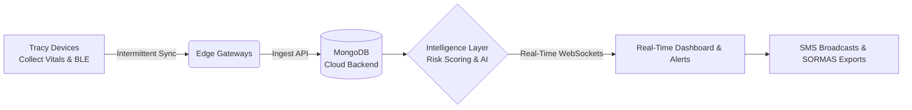

# Presentation Slides

````carousel
# Slide 1: Team Name & Members
**Project:** Sentinel Mesh  
**Track:** Global Health & Epidemiology Innovation  
**Team Members:** [Insert Names]

*A decentralized, AI-driven IoT mesh for proactive outbreak suppression.*
<!-- slide -->
# Slide 2: Problem Statement & Target Users

### The Problem
* Viral outbreaks in underserved communities often spread undetected until local clinics are completely overwhelmed.
* Traditional contact tracing is manual, retrospective, and extremely slow.
* Rural and under-resourced regions suffer from intermittent internet connectivity, rendering cloud-only solutions useless.

### Target Users
* **Primary:** Community Health Extension Workers (CHEWs) and Field Epidemiologists.
* **Secondary:** Executive Health Agencies & Ministries of Health.
<!-- slide -->
# Slide 3: System Overview


<!-- slide -->
# Slide 4: Data Collection & Ingestion Layer

### Data Collection: Tracy Devices
* Wearable IoT sensors distributed to the community.
* **Sensors:** Heart Rate, SpO2, Body Temperature.
* **Connectivity:** Emits and scans for Bluetooth Low Energy (BLE) beacons to record proximity.

### Data Ingestion
* Caches data locally to handle **intermittent connectivity**.
* Opportunistically syncs payload batches via Edge Gateways to a high-throughput **FastAPI backend**.
* Data is validated and routed to three main MongoDB collections: `vitals`, `contacts`, and `mobility`.
<!-- slide -->
# Slide 5: Intelligence Layer - Component 1

### Phase 1 & 2 Risk Scoring
* **Phase 1 (Physiological):** Analyzes the `vitals` dataset against biological thresholds (e.g., Temp > 38.0). Spikes in vitals elevate base risk, flagging "Patient Zero" candidates.
* **Phase 2 (Network Centrality):** Analyzes the `contacts` dataset (BLE proximity). If a healthy user has been in close contact with an infected user, their secondary risk score spikes. This graph propagation behaves similarly to PageRank.
<!-- slide -->
# Slide 6: Intelligence Layer - Component 2

### Geospatial Clustering & AI Reasoning
* **Spatial Clustering (DBSCAN/K-Means):** Groups high-risk individuals using the `mobility` dataset to define physical bounding boxes known as "Affected Neighborhoods."
* **Sentinel AI Assistant (Groq / LLaMA 3.3):** Consumes the raw clustering and risk data to provide human-readable, conversational insights. The AI explains *why* a node is risky and automatically drafts deployment checklists or executive reports.
<!-- slide -->
# Slide 7: Output Layer - Dashboards & Alerts

* **Real-time Synchronization:** Powered by bi-directional WebSockets, UI elements update instantly as data arrives.
* **Contact Tracing Map:** A visual, force-directed graph showing exact transmission vectors.
* **Community Health Watch:** Actionable alerts that allow workers to instantly:
  * Draft localized warnings.
  * Dispatch SMS broadcasts via Africa's Talking.
  * Generate official PDF reports for global SORMAS integration.
<!-- slide -->
# Slide 8: Live Prototype Demo

*(Placeholder for Live Demo or Screenshot Walkthrough)*

### Demonstration Highlights:
1. **Interactive Simulator:** Watch 50 software agents generate organic telemetry data.
2. **Injecting an Anomaly:** We manually induce a high fever on a simulated node.
3. **The Ripple Effect:** Watch the Dashboard graphs instantly surge and the Network Map highlight the infected user and their recent contacts.
4. **AI Reasoning:** We ask Sentinel AI for an analysis of the new anomaly.
<!-- slide -->
# Slide 9: Real-World Deployment Plan

### Overcoming Challenges
* **Intermittent Connectivity:** Devices buffer data onboard; syncs happen opportunistically without needing 24/7 cellular signals.
* **Privacy:** Cryptographic, rotating beacon IDs. No PII is broadcasted over the air. Strict Role-Based Access Control (RBAC) ensures workers only see their assigned zones.
* **Scalability:** Horizontal database sharding and asynchronous Python web servers allow scaling from a 35-device pilot to a 3,500-device city deployment.
<!-- slide -->
# Slide 10: Impact & Who Benefits

### Shifting from Reactive to Proactive
Instead of waiting for hospitals to report a surge in cases, **Sentinel Mesh** identifies micro-clusters at the neighborhood level *before* they scale.

### The Beneficiaries
* **Underserved Communities:** Receive targeted medical interventions days or weeks faster.
* **Public Health Officials:** Can deploy precise resources (e.g., isolating a single block instead of locking down an entire city).
<!-- slide -->
# Slide 11: Limitations & What Comes Next

### Current Limitations
* The prototype relies on a software simulator; hardware integrations with physical Tracy devices are pending.
* Anomaly thresholds are currently static across all demographics.

### What Comes Next
1. **Hardware Fabrication:** Developing custom firmware for the Tracy devices.
2. **Dynamic Baselines:** Upgrading the ML layer to learn individual biological baselines, drastically reducing false positives.
3. **Direct SORMAS API Integration:** Moving from exported PDFs to direct API-to-API syncing.
<!-- slide -->
# Slide 12: Summary & Call to Action

### Summary
Sentinel Mesh bridges the gap between passive IoT monitoring and active outbreak suppression. By merging real-time contact tracing, vital sign telemetry, and edge AI, we give health workers the ultimate radar for disease control.

### Call to Action
Let's bring Sentinel Mesh from software prototype to physical reality. We are seeking partnerships for hardware pilot programs in high-risk zones.

**Thank you!**
````
