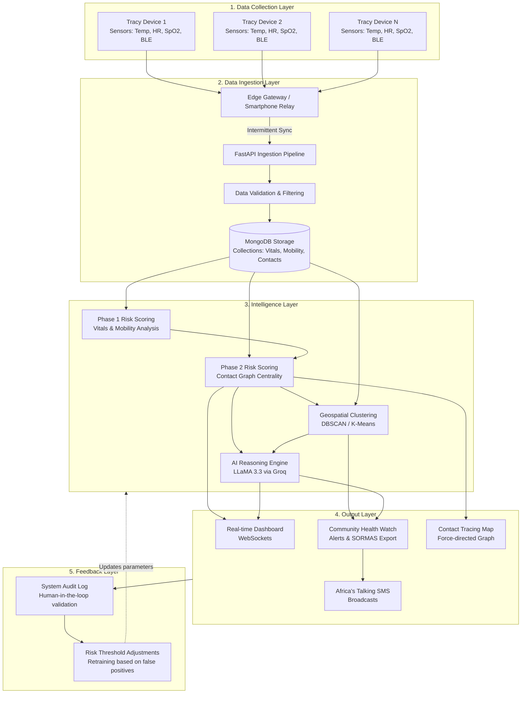

# System Architecture Diagram

## Layer Descriptions

1. **Data Collection Layer**: Composed of Tracy devices and sensors worn by individuals. These devices actively monitor physiological vitals (Temperature, Heart Rate, SpO2) and emit/receive Bluetooth Low Energy (BLE) beacons to record proximity with other Tracy devices.
2. **Data Ingestion Layer**: Tracy devices sync their cached data to Edge Gateways or smartphones, which push the JSON payloads to the FastAPI backend. Data is validated (removing malformed readings) and routed into distinct MongoDB collections (`vitals`, `mobility`, `contacts`).
3. **Intelligence Layer**: The core analytical engine. It computes individual risk through Phase 1 (physiological anomalies) and Phase 2 (network centrality based on contacts). Geospatial algorithms cluster high-risk nodes into affected neighborhoods. The AI Reasoning Engine (Groq/LLaMA) synthesizes this data to generate insights and clinical rationale.
4. **Output Layer**: A Next.js frontend consuming bi-directional WebSockets. Health officials interact with the Real-time Dashboard, the Contact Tracing Map, and the Community Health Alerts panel. Interventions are triggered here, such as exporting SORMAS PDFs or dispatching SMS warnings via Africa's Talking.
5. **Feedback Layer**: Health workers validate or dismiss alerts generated by the Intelligence Layer. These human-in-the-loop decisions are logged in the Audit database and used to tune anomaly thresholds (e.g., adjusting the temperature baseline for a specific demographic) to improve the system's accuracy over time.
